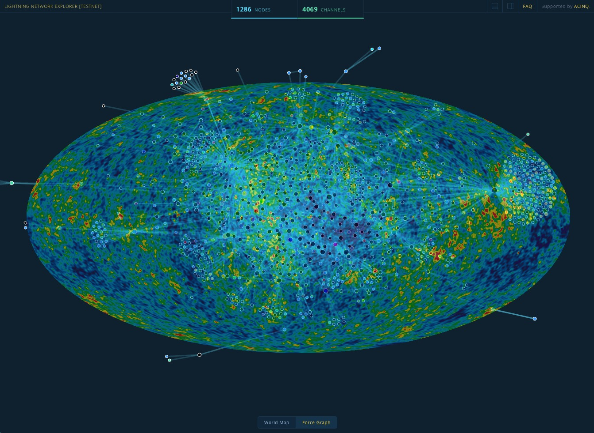

# CMBGraph

We can learn a lot of interesting physics from the Cosmic Microwave Background (CMB) using classical statistical techniques and state-of-the-art data from the Planck collaboration. The question we look to answer here is what data format is the most robust to non-standard methods such as Machine Learning techniques.

## Research Question

We will look to answer the following basic question:

> What is the best format to reconstruct the CMB temperature power spectrum from a given CMB map?

## Methodology

To do so, we'll consider three basic structures and architectures:

* **[A1]** A very basic feedforward network with a one-dimensional input - we expect this to perform poorly and take a long time to train. Furthermore, we would expect it to not be robust at all to slight modifications (e.g. reorderings/deletions) in the original map.

* **[A2]** A more complicated convolutional neural network acting on the true pixel map - we expect this to perform better as it has spatial information naturally encoded into the data format.

* **[A3]** Finally, we will look at encoding the CMB as a graph (in the mathematical sense) with the power spectrum encoded in the edges. We expect this will be the most robust to any deletions and reorderings.
